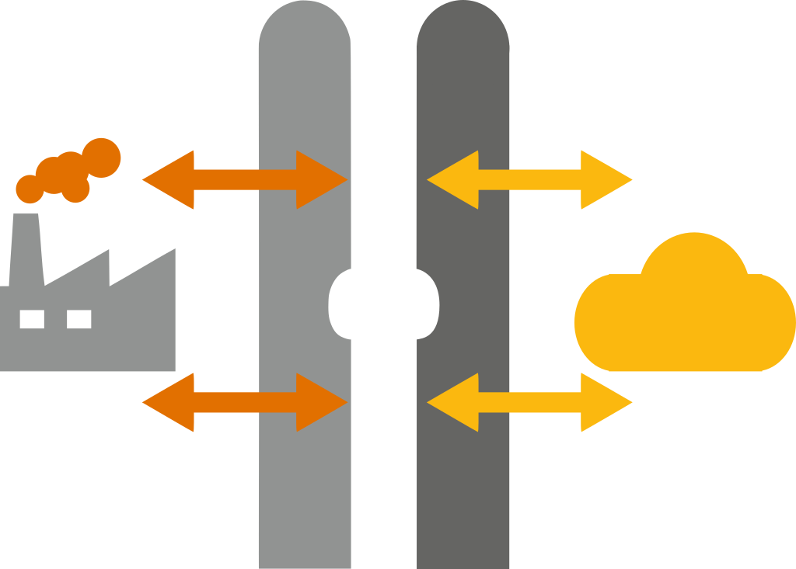
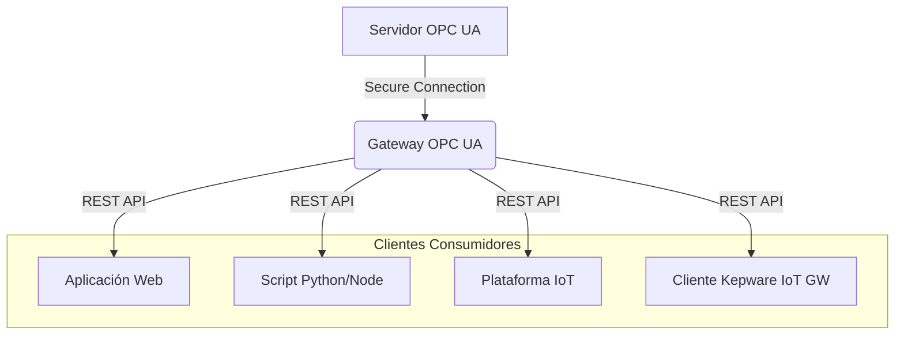

[Read this in English](README.md)

# Gateway OPC UA

<p align="center">
   
</p>

**¿Necesitas acceder a datos de tus servidores OPC UA desde aplicaciones web o sistemas IT de forma sencilla y segura? Este Gateway actúa como un puente robusto, ofreciendo una API REST moderna y monitoreo avanzado sobre OPC UA.**

## [](https://opensource.org/licenses/MIT)

## Arquitectura Simplificada


```mermaid
graph TD
    A[Servidor OPC UA] -- Secure Connection --> B(Gateway OPC UA);
    B -- REST API --> D[Aplicación Web];
    B -- REST API --> E[Script Python/Node];
    B -- REST API --> F[Plataforma IoT];
    B -- REST API --> G[Cliente Kepware IoT GW];
    subgraph Clientes Consumidores
        direction LR %% Forzar layout interno si es necesario %%
        D
        E
        F
        G
    end
```

---

## ¿Por Qué Usar Este Gateway?

- **Simplifica el Acceso a OPC UA:** Olvídate de las complejidades del protocolo OPC UA. Interactúa usando una simple API REST.
- **Integración IT/OT:** Facilita la conexión entre el mundo de la operación (OT) y los sistemas de información (IT).
- **Seguridad Centralizada:** Gestiona la seguridad de la conexión OPC UA y de la API en un solo lugar.
- **Monitoreo Estándar:** Usa SNMP (v1/v2c/v3) y/o la API REST para monitorizar el estado y rendimiento del gateway.
- **Compatibilidad:** Endpoints `/api/iotgateway` diseñados para facilitar la migración desde o la coexistencia con Kepware IoT Gateway.
- **Open Source:** Totalmente gratuito, código abierto (MIT License) y con posibilidad de contribuir.
- **Moderno y Ligero:** Construido con Node.js, ideal para despliegues eficientes.

---

## Casos de Uso Comunes

- Visualizar datos de producción de PLCs (vía OPC UA) en dashboards web (Grafana, etc.) en tiempo real.
- Integrar alarmas OPC UA con sistemas de ticketing, bases de datos o notificaciones (Email, Slack).
- Almacenar datos históricos de proceso de un SCADA en bases de datos time-series (InfluxDB, TimescaleDB).
- Permitir a scripts (Python, Node.js) leer/escribir datos en sistemas de control de forma controlada y segura.
- Migrar aplicaciones cliente que usaban Kepware IoT Gateway hacia una solución open-source.

---

## Tabla de Contenidos

- [Inicio Rápido (Docker)](#inicio-rápido-docker)
- [Características Principales](#características-principales)
- [Instalación y Despliegue](#instalación-y-despliegue)
  - [Usando Docker (Recomendado)](#usando-docker-recomendado)
  - [Configuración de Desarrollo Nativo](#configuración-de-desarrollo-nativo)
  - [Despliegue en Producción Nativo](#despliegue-en-producción-nativo)
- [Configuración](#configuración)
  - [Variables de Entorno](#variables-de-entorno)
- [Seguridad Detallada](#seguridad-detallada)
  - [Métodos de Autenticación API](#métodos-de-autenticación-api)
  - [Limitación de Solicitudes](#limitación-de-solicitudes)
  - [Protección CORS](#protección-cors)
  - [Encabezados de Seguridad (Helmet)](#encabezados-de-seguridad-helmet)
- [Métricas y Monitoreo](#métricas-y-monitoreo)
  - [Acceso vía API REST](#acceso-vía-api-rest)
  - [Acceso vía SNMP](#acceso-vía-snmp)
  - [Configuración del Agente SNMP](#configuración-del-agente-snmp)
  - [Monitoreo con Zabbix](#monitoreo-con-zabbix)
  - [Métricas Disponibles](#métricas-disponibles)
- [Endpoints de la API](#endpoints-de-la-api)
  - [Leer valores OPC UA (`/api/iotgateway`)](#leer-valores-opc-ua-apiiotgateway)
  - [Escribir valores OPC UA (`/api/iotgateway`)](#escribir-valores-opc-ua-apiiotgateway)
  - [Otros Endpoints API (`/api`)](#otros-endpoints-api-api)
- [Estructura del Proyecto](#estructura-del-proyecto)
- [Manejo de Errores](#manejo-de-errores)
- [Mejores Prácticas de Seguridad](#mejores-prácticas-de-seguridad)
- [Requisitos](#requisitos)
- [Código de Conducta](#código-de-conducta)
- [Contribuir](#contribuir)
- [Licencia](#licencia)
- [Autor](#autor)

---

## Inicio Rápido (Docker)

La forma más rápida y recomendada para ejecutar el gateway usando Docker y la imagen oficial de Docker Hub:

1.  **Crear archivo `docker-compose.yml`:**
    Crea un archivo llamado `docker-compose.yml` en una carpeta de tu elección con el siguiente contenido:

    ```yaml
    version: '3.8'
    services:
      opcua-gateway:
        image: exacross/opcua-gateway:latest # Utiliza la imagen de Docker Hub
        container_name: opcua-gw
        ports:
          - '3000:3000' # Mapea el puerto del host al contenedor
        env_file:
          - .env # Carga variables de entorno desde el archivo .env
        restart: unless-stopped
        # Opcional: Montar volumen para certificados si usas modos seguros
        # volumes:
        #   - ./certificates:/app/certificates
    ```

2.  **Crear archivo `.env`:**
    En la misma carpeta donde creaste `docker-compose.yml`, crea un archivo llamado `.env`. Copia y pega las variables de configuración necesarias desde la sección [Variables de Entorno](#variables-de-entorno). **Como mínimo, necesitas configurar:**

    ```env
    # Obligatorias para la conexión básica
    OPC_ENDPOINT=opc.tcp://TU_SERVIDOR_OPCUA:4840

    # Obligatorias para la seguridad de la API (elige una o ambas)
    API_KEY=UNA_CLAVE_API_SEGURA_AQUI
    # o
    AUTH_USERNAME=tu_usuario_basic
    AUTH_PASSWORD=tu_password_basic

    # Recomendadas (ajusta según necesidad)
    LOG_LEVEL=info
    LOG_TO_CONSOLE=true
    # ... otras variables que necesites modificar ...
    ```

    _Reemplaza los valores de ejemplo con tu configuración real._

    > La autenticación es obligatoria. Configura un `API_KEY` no vacío, o
    > configura tanto `AUTH_USERNAME` como `AUTH_PASSWORD`. Si ninguno de los
    > métodos está completo, el gateway finaliza antes de abrir el puerto HTTP.
    > Mantén `.env` fuera del control de versiones y no guardes credenciales de
    > producción en `docker-compose.yml`.

3.  **Iniciar el Contenedor:**
    Abre una terminal en la carpeta donde creaste los archivos y ejecuta:

    ```bash
    docker-compose up -d
    ```

    Docker descargará (`pull`) automáticamente la imagen `exacross/opcua-gateway:latest` si no la tienes localmente y luego iniciará el contenedor.

4.  **Verificar estado:**
    Espera unos segundos y comprueba el endpoint de salud:
    ```bash
    curl -H "X-API-Key: UNA_CLAVE_API_SEGURA_AQUI" http://localhost:3000/health
    # O con Basic Auth:
    # curl -u "tu_usuario_basic:tu_password_basic" http://localhost:3000/health
    # Deberías ver una respuesta JSON indicando el estado "UP" y "CONNECTED"
    ```

¡Listo! El gateway está funcionando y accesible en `http://localhost:3000`, usando la imagen oficial y tu configuración local.

---

## Características Principales

- 🔐 **Conexión Segura:** Soporte para diferentes modos y políticas de seguridad OPC UA.
- 🚀 **API REST Moderna:** Endpoints intuitivos para leer y escribir valores OPC UA.
- 🤝 **Compatibilidad Kepware:** Endpoints `/api/iotgateway` para fácil integración/migración.
- 🔗 **Agrupamiento de Conexiones:** Gestión eficiente de sesiones OPC UA.
- 🔄 **Reconexión Automática:** Manejo robusto de desconexiones y reintentos configurables.
- 🛡️ **Seguridad API Completa:** Autenticación dual (Basic/API Key), Rate Limiting, CORS, Helmet.
- 📊 **Monitoreo Avanzado:** Métricas detalladas vía API REST y **SNMP** (v1/v2c/v3) con plantilla Zabbix.
- 📝 **Registro Configurable:** Niveles de log, salida a consola y/o archivos.
- ⚙️ **Modular y Mantenible:** Estructura de proyecto clara y organizada.
- 🐳 **Despliegue Fácil:** Listo para usar con Docker y Docker Compose.
- 📄 **Open Source (MIT):** Libertad para usar, modificar y distribuir.

---

## Instalación y Despliegue

### Usando Docker (Recomendado)

Consulta la sección [Inicio Rápido (Docker)](#inicio-rápido-docker).

Para construir la imagen manualmente:

```bash
docker build -t opcua-gateway .
```

Para ejecutar el contenedor manualmente (asegúrate de tener tu `.env` listo):

```bash
docker run -d \
  -p 3000:3000 \
  --name opcua-gw \
  --env-file .env \
  opcua-gateway
```

### Configuración de Desarrollo Nativo

```bash
# 1. Clonar el repositorio (si no lo has hecho)
git clone https://github.com/tinroad/opcua-gateway.git
cd opcua-gateway

# 2. Instalar dependencias
npm install

# 3. Configurar variables de entorno
cp .env.example .env
# Editar .env con tu configuración de desarrollo

# 4. Iniciar servidor de desarrollo (con nodemon para recarga automática)
npm run dev
```

### Despliegue en Producción Nativo

```bash
# 1. Asegúrate de tener Node.js >= 14.0.0 en tu servidor

# 2. Clona o copia el código fuente en tu servidor

# 3. Instala SOLO dependencias de producción
npm install --production

# 4. Configura las variables de entorno en `.env`
# ¡ASEGÚRATE DE USAR CREDENCIALES Y CONFIGURACIONES SEGURAS PARA PRODUCCIÓN!

# 5. Inicia el servidor (recomendado usar un gestor de procesos como pm2)
npm start
# O con pm2:
# pm2 start src/server.js --name opcua-gateway
```

---

## Configuración

### Variables de Entorno

El gateway se configura completamente a través de variables de entorno
definidas en un archivo `.env` en la raíz del proyecto. Copia `.env.example`
para empezar. La autenticación es obligatoria al iniciar: define un `API_KEY` no
vacío, o define tanto `AUTH_USERNAME` como `AUTH_PASSWORD`. El proceso finaliza
con un error de configuración si ninguno de los métodos está completo. El
archivo `docker-compose.yml` del repositorio reenvía estos valores desde el
entorno o desde `.env` y no incluye secretos predeterminados.

```env
# === Configuración OPC UA Core ===
OPC_ENDPOINT=opc.tcp://127.0.0.1:4840       # URL del servidor OPC UA
OPC_SECURITY_MODE=1                        # 1:None, 2:Sign, 3:SignAndEncrypt
OPC_SECURITY_POLICY=None                   # None, Basic128Rsa15, Basic256, Basic256Sha256, Aes128_Sha256_RsaOaep, Aes256_Sha256_RsaPss
OPC_NAMESPACE=2                            # Namespace por defecto para IDs de nodo (si no se especifica)
OPC_APPLICATION_URI=urn:CLIENT:NodeOPCUA-Client # URI de la aplicación cliente

# === Configuración de Certificados OPC UA (solo para modos seguros > 1) ===
OPC_CERTIFICATE_FILE=./certificates/client_cert.pem
OPC_PRIVATE_KEY_FILE=./certificates/client_key.pem
OPC_TRUSTED_FOLDER=./certificates/trusted     # Certificados de servidores confiables
OPC_REJECTED_FOLDER=./certificates/rejected   # Certificados rechazados

# === Configuración de Conexión OPC UA ===
CONNECTION_RETRY_MAX=5                     # Reintentos máximos por intento de conexión
CONNECTION_INITIAL_DELAY=1000              # Retardo inicial antes del primer intento (ms)
CONNECTION_MAX_RETRY=10                    # Máximos intentos globales de reconexión (-1 para infinito)
CONNECTION_MAX_DELAY=10000                 # Retardo máximo entre reintentos (ms)
CONNECTION_RETRY_DELAY=5000                # Retardo base entre reintentos (ms)

# === Configuración del Servidor Web ===
SERVER_PORT=3000                           # Puerto en el que escuchará el gateway

# === Configuración de Seguridad API ===
# Configura al menos un método de autenticación completo:
# Opción A: clave API
API_KEY=your_api_key_here                  # Clave secreta para autenticación X-API-Key
# Opción B: Autenticación Básica (ambos valores son obligatorios)
AUTH_USERNAME=admin                        # Usuario para Autenticación Básica
AUTH_PASSWORD=your_secure_password         # Contraseña para Autenticación Básica
ALLOWED_ORIGINS=http://localhost:3000,[https://your-frontend-domain.com](https://your-frontend-domain.com) # Orígenes CORS permitidos (separados por comas)
CORS_MAX_AGE=600                           # Tiempo de caché preflight CORS (segundos)
RATE_LIMIT_WINDOW_MS=900000                # Ventana de tiempo para límite de tasa (15 minutos por defecto)
RATE_LIMIT_MAX=100                         # Máximo de solicitudes por IP en la ventana

# === Configuración de Registro (Logging) ===
LOG_LEVEL=info                             # Nivel de log: error, warn, info, http, verbose, debug, silly
LOG_FILE_ERROR=error.log                   # Archivo para logs de error
LOG_FILE_COMBINED=combined.log             # Archivo para todos los logs
LOG_TO_CONSOLE=true                        # ¿Mostrar logs en consola? (true/false)

# === Configuración SNMP ===
ENABLE_SNMP=true                           # Habilitar agente SNMP (true/false)
SNMP_PORT=161                              # Puerto del agente SNMP
SNMP_COMMUNITY=public                      # Comunidad para SNMP v1/v2c
SNMP_VERSION=3                             # Versión SNMP: 1, 2c, o 3
# --- Configuración SNMPv3 (si SNMP_VERSION=3) ---
SNMP_SECURITY_NAME=opcgwuser               # Usuario SNMPv3 principal
SNMP_SECURITY_LEVEL=authPriv               # Nivel: noAuthNoPriv, authNoPriv, authPriv
SNMP_AUTH_PROTOCOL=SHA256                  # Protocolo Auth: MD5, SHA1, SHA224, SHA256, SHA384, SHA512
SNMP_AUTH_KEY=opcgw_auth_key               # Clave Auth (min 8 chars)
SNMP_PRIV_PROTOCOL=AES128                  # Protocolo Priv: DES, AES128, AES192, AES256, AES192C, AES256C
SNMP_PRIV_KEY=opcgw_priv_key               # Clave Priv (min 8 chars)
# --- Usuario SNMPv3 Adicional (Opcional) ---
# SNMP_USER_2_NAME=zabbix
# SNMP_USER_2_LEVEL=authPriv
# ... (configuración completa para el usuario 2)
```

---

## Seguridad Detallada

La seguridad es fundamental. Este gateway implementa varias capas:

### Métodos de Autenticación API

Todos los endpoints HTTP expuestos por la aplicación, incluido `/health`, están
protegidos por el middleware global de autenticación. Configura al menos uno de
los siguientes métodos; ambos pueden estar habilitados simultáneamente:

1.  **Autenticación Básica:**

    - Usa usuario y contraseña (`AUTH_USERNAME`, `AUTH_PASSWORD`).
    - Solo se habilita cuando ambos valores están definidos y no están vacíos.
    - Ideal para pruebas rápidas o acceso humano.
    - Ejemplo con `curl`:
      ```bash
      curl -X GET "http://localhost:3000/api/iotgateway/read?ids=MiVariable" \
           -u "admin:your_secure_password"
      ```

2.  **Autenticación por Clave API:**
    - Usa una clave secreta (`API_KEY`) enviada en el encabezado `X-API-Key`.
    - Solo se habilita cuando `API_KEY` está definido y no está vacío.
    - Recomendado para comunicación máquina a máquina (M2M).
    - Ejemplo con `curl`:
      ```bash
      curl -X GET "http://localhost:3000/api/iotgateway/read?ids=MiVariable" \
           -H "X-API-Key: your_api_key_here"
      ```

Las credenciales ausentes, vacías, mal formadas o inválidas reciben
`401 Unauthorized` y nunca alcanzan las rutas OPC UA.

### Limitación de Solicitudes

- Protege contra fuerza bruta y ataques DoS limitando el número de solicitudes por IP (`RATE_LIMIT_WINDOW_MS`, `RATE_LIMIT_MAX`).
- Responde con `429 Too Many Requests` si se excede el límite.

### Protección CORS

- Controla qué orígenes (navegadores web) pueden hacer solicitudes a la API (`ALLOWED_ORIGINS`).
- Configurable para permitir credenciales y métodos específicos.

### Encabezados de Seguridad (Helmet)

- Aplica automáticamente varios encabezados HTTP de seguridad para proteger contra ataques comunes (XSS, clickjacking, etc.).

---

## Métricas y Monitoreo

Obtén visibilidad sobre el rendimiento y estado del gateway:

### Acceso vía API REST

Endpoints bajo `/api/metrics` (requieren autenticación) que exponen métricas en formato JSON:

- `/api/metrics`: Todas las métricas.
- `/api/metrics/opcua`: Métricas específicas de OPC UA.
- `/api/metrics/http`: Métricas de solicitudes HTTP.
- `/api/metrics/system`: Métricas del sistema (CPU, memoria, etc.).

### Acceso vía SNMP

Si `ENABLE_SNMP=true`, el gateway actúa como un agente SNMP.

- Soporta **SNMP v1, v2c y v3**.
- Expone métricas usando OIDs bajo la base empresarial `1.3.6.1.4.1.12345`.

### Configuración del Agente SNMP

- Configura la versión, puerto, comunidad (v1/v2c) o credenciales de seguridad (v3) usando las variables de entorno `SNMP_*`.
- SNMPv3 es **recomendado para producción** por su seguridad mejorada (autenticación y encriptación).

### Monitoreo con Zabbix

¡Simplifica la integración con Zabbix!

1.  Asegúrate de que `ENABLE_SNMP` esté activo en `.env`.
2.  Genera la plantilla XML de Zabbix:
    ```bash
    npm run generate:zabbix
    # Opciones para personalizar la versión SNMP y seguridad:
    # node src/tools/generateZabbixTemplate.js --help
    ```
3.  Importa el archivo `tools/zabbix_template.xml` generado en tu servidor Zabbix.
4.  Añade el gateway como un Host en Zabbix, configura la interfaz SNMP (IP, puerto, versión, comunidad/credenciales) y enlaza la plantilla importada.

### Métricas Disponibles

Se monitorizan métricas clave en tres categorías (lista no exhaustiva):

- **OPC UA:** Conexiones activas, errores, reintentos, latencia de lectura/escritura.
- **HTTP:** Conteo de solicitudes (por status code), errores, latencia, bloqueos por rate limit.
- **Sistema:** Uso de CPU, uso de memoria, tiempo de actividad.

Consulta los OIDs específicos en los logs al iniciar con SNMP habilitado o en el código fuente para un detalle completo.

---

## Endpoints de la API

### Leer valores OPC UA (`/api/iotgateway`)

```http
GET /api/iotgateway/read?ids=<node-id>
```

- **Autenticación:** Basic Auth (`-u user:pass`) O API Key (`-H "X-API-Key: key"`).
- **Parámetros Query:**
  - `ids` (requerido): Un ID de nodo de tipo string. El gateway aplica el namespace configurado en `OPC_NAMESPACE`. (Ej: `MiVariable`)
- **Respuesta Exitosa (200 OK):**
  ```json
  {
  	"readResults": [
  		{
			"id": "MiVariable",
  			"s": true, // Éxito (status code OPC UA)
  			"r": "Good", // Razón / Descripción del estado
  			"v": "123.45", // Valor leído
  			"t": 1678886400000 // Timestamp (source timestamp OPC UA)
  		}
  		// ... más resultados
  	]
  }
  ```
- **Respuesta de Error (Ej: 400 Bad Request si faltan IDs):**
  ```json
  {
	"error": "ID is required"
  }
  ```

### Escribir valores OPC UA (`/api/iotgateway`)

```http
POST /api/iotgateway/write
Content-Type: application/json
```

- **Autenticación:** Basic Auth O API Key.
- **Cuerpo de la Solicitud (JSON):** Un array de objetos a escribir.
  ```json
  [
  	{
		"id": "MiVariable",
  		"value": "NuevoValor"
  		// "dataType": "String" // Opcional: Especificar tipo de dato OPC UA (ej: Double, Int32, Boolean)
  	},
  	{
		"id": "OtraVariable",
  		"value": true,
  		"dataType": "Boolean"
  	}
  	// ... más valores a escribir
  ]
  ```
- **Respuesta Exitosa (200 OK):**
  ```json
  {
	"writeResults": [
		{
			"s": true,
			"v": "NuevoValor",
			"r": "Good" // Estado OPC UA de la escritura
  		}
  		// ... más resultados
  	]
  }
  ```
- **Respuesta de Error (Ej: 400 Bad Request si el cuerpo es inválido):**
  ```json
  {
	"error": "The request body must be an array of values to write"
  }
  ```

### Otros Endpoints API (`/api`)

Estos endpoints proporcionan funcionalidad adicional o acceso directo (requieren autenticación):

- `GET /api/opcua/status`: Estado de la conexión OPC UA.
- `GET /api/opcua/nodes/:nodeId/read`: Lectura directa de un solo nodo (ID codificado para URL).
- `POST /api/opcua/read`: Lectura de un nodo string mediante `{"namespace": ..., "nodeId": ...}`.
- `POST /api/opcua/write/:nodeId`: Escritura directa a un solo nodo (URL-encoded ID, valor en body JSON `{"value": ...}`).
- `GET /api/metrics/...`: Endpoints de métricas detalladas.

### Endpoint de Salud Protegido

- `GET /health`: Estado de salud básico del gateway. Requiere la misma clave API
  o las mismas credenciales Basic que el resto de los endpoints HTTP; configura
  los checks de servicio y balanceadores de carga en consecuencia.
  ```json
  {
  	"status": "UP",
  	"opcClient": "CONNECTED", // o "DISCONNECTED", "CONNECTING"
  	"opcEndpoint": "opc.tcp://127.0.0.1:4840",
  	"time": 1678886500000
  }
  ```

---

## Estructura del Proyecto

```
project/
├── src/
│   ├── config/         # Archivos de configuración (central, CORS)
│   ├── services/       # Lógica de negocio principal (Servicio OPC UA)
│   ├── middleware/     # Middlewares Express (Auth, Logging, Rate Limit)
│   ├── routes/         # Definición de rutas API (Express)
│   ├── utils/          # Utilidades (Logger, etc.)
│   ├── tools/          # Herramientas (Generador plantilla Zabbix)
│   ├── app.js          # Configuración de la aplicación Express
│   └── server.js       # Punto de entrada, inicio del servidor
├── certificates/         # Certificados OPC UA (cliente, trusted, rejected)
├── public/             # Archivos estáticos (si los hubiera)
├── .env                # Variables de entorno (NO versionar)
├── .env.example        # Ejemplo de variables de entorno
├── Dockerfile          # Definición de la imagen Docker
└── docker-compose.yml  # Definición del servicio Docker Compose
```

---

## Manejo de Errores

- Reconexión automática robusta a OPC UA con backoff exponencial.
- Registro detallado de errores OPC UA y HTTP.
- Middleware centralizado para capturar errores de la aplicación Express.
- Respuestas de error JSON consistentes para la API (4xx/5xx).
  - `401 Unauthorized`: Autenticación requerida o inválida.
  - `403 Forbidden`: Autenticación correcta pero sin permisos (no aplica actualmente).
  - `429 Too Many Requests`: Límite de tasa excedido.
  - `400 Bad Request`: Solicitud mal formada (parámetros faltantes, JSON inválido).
  - `500 Internal Server Error`: Error inesperado en el servidor.
  - `503 Service Unavailable`: Error de conexión OPC UA u otro servicio crítico.

---

## Mejores Prácticas de Seguridad

1.  **Credenciales:** Usa claves API fuertes y rótalas periódicamente. Usa contraseñas robustas para Basic Auth. ¡Nunca compartas el archivo `.env`!
2.  **HTTPS:** En producción, **SIEMPRE** ejecuta este gateway detrás de un proxy inverso (Nginx, Traefik, Caddy) que gestione HTTPS/TLS.
3.  **Red:** Limita el acceso al puerto del gateway (`SERVER_PORT`) solo a las IPs/redes necesarias (firewall).
4.  **CORS:** Configura `ALLOWED_ORIGINS` de forma restrictiva solo a los dominios frontend que necesiten acceso.
5.  **Rate Limiting:** Ajusta los límites (`RATE_LIMIT_*`) según tu tráfico esperado para prevenir abusos.
6.  **SNMPv3:** Si usas SNMP en producción, prefiere SNMPv3 con `authPriv` para máxima seguridad.
7.  **Actualizaciones:** Mantén actualizadas las dependencias (Node.js, librerías npm) para corregir vulnerabilidades.

---

## Requisitos

- Node.js >= 14.0.0
- Servidor OPC UA accesible en la red.
- (Opcional) Certificados OPC UA válidos si usas modos de seguridad Sign o SignAndEncrypt.
- (Recomendado) Docker y Docker Compose para despliegue fácil.

---

## Código de Conducta

Este proyecto se adhiere a un [Código de Conducta](CODE_OF_CONDUCT.md). Al participar, aceptas cumplir sus términos.

---

## Contribuir

¡Las contribuciones son bienvenidas! Si quieres ayudar a mejorar este proyecto, aquí tienes algunas ideas:

- Reporta bugs o sugiere nuevas funcionalidades creando un [Issue en GitHub](https://github.com/tinroad/opcua-gateway/issues).
- Revisa los [issues abiertos](https://github.com/tinroad/opcua-gateway/issues), especialmente los etiquetados como `good first issue` o `help wanted`.
- Mejora la documentación.
- Envía Pull Requests con correcciones o nuevas características.

Este proyecto utiliza [Commits Convencionales](https://www.conventionalcommits.org/) para los mensajes de commit. Esto ayuda a mantener un historial limpio y generar changelogs automáticamente. El formato básico es:

```
<tipo>(<ámbito>): <descripción>
```

Donde `<tipo>` puede ser `feat`, `fix`, `docs`, `style`, `refactor`, `perf`, `test`, `build`, `ci`, `chore`, `revert`, `config`.

Para más detalles sobre cómo contribuir, consulta [CONTRIBUTING.md](CONTRIBUTING.md).

---

## Licencia

Distribuido bajo la Licencia MIT. Ver [LICENSE](LICENSE) para más información.

---

## Autor

## **Diego Morales**
