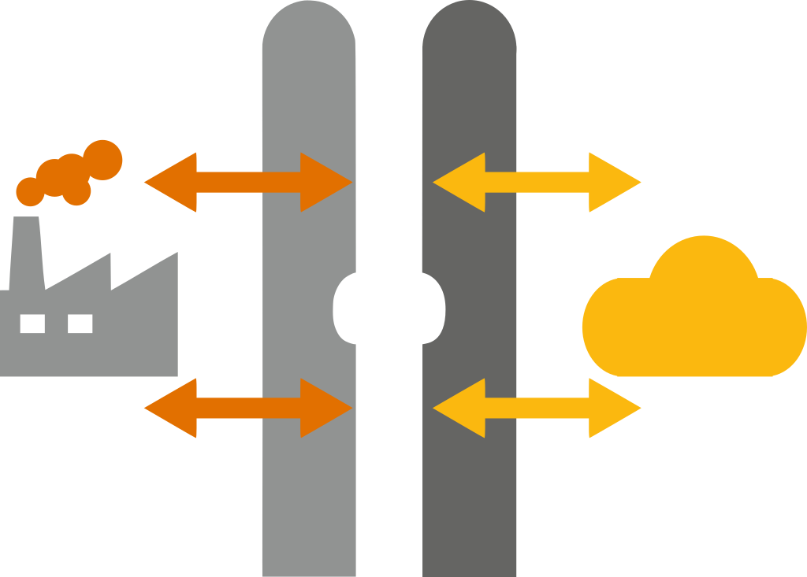
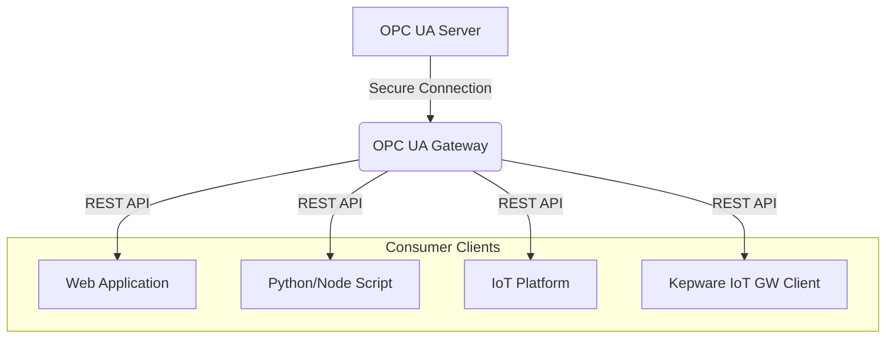

[Leer esto en Español](README.es.md)

# OPC UA Gateway

<p align="center">
   
</p>

**Do you need to access data from your OPC UA servers from web applications or IT systems easily and securely? This Gateway acts as a robust bridge, offering a modern REST API and advanced monitoring over OPC UA.**

## [](https://opensource.org/licenses/MIT)

## Simplified Architecture



---

## Why Use This Gateway?

- **Simplifies OPC UA Access:** Forget the complexities of the OPC UA protocol. Interact using a simple REST API.
- **IT/OT Integration:** Facilitates the connection between the operational technology (OT) world and information technology (IT) systems.
- **Centralized Security:** Manage OPC UA connection security and API security in one place.
- **Standard Monitoring:** Use SNMP (v1/v2c/v3) and/or the REST API to monitor the gateway's status and performance.
- **Compatibility:** `/iotgateway` endpoints designed to ease migration from or coexistence with Kepware IoT Gateway.
- **Open Source:** Completely free, open-source code (MIT License) with the possibility to contribute.
- **Modern and Lightweight:** Built with Node.js, ideal for efficient deployments.

---

## Common Use Cases

- Visualize production data from PLCs (via OPC UA) on web dashboards (Grafana, etc.) in real-time.
- Integrate OPC UA alarms with ticketing systems, databases, or notification services (Email, Slack).
- Store historical process data from a SCADA system in time-series databases (InfluxDB, TimescaleDB).
- Allow scripts (Python, Node.js) to read/write data in control systems in a controlled and secure manner.
- Migrate client applications that used Kepware IoT Gateway to an open-source solution.

---

## Table of Contents

- [Quick Start (Docker)](#quick-start-docker)
- [Main Features](#main-features)
- [Installation and Deployment](#installation-and-deployment)
  - [Using Docker (Recommended)](#using-docker-recommended)
  - [Native Development Setup](#native-development-setup)
  - [Native Production Deployment](#native-production-deployment)
- [Configuration](#configuration)
  - [Environment Variables](#environment-variables)
- [Detailed Security](#detailed-security)
  - [API Authentication Methods](#api-authentication-methods)
  - [Rate Limiting](#rate-limiting)
  - [CORS Protection](#cors-protection)
  - [Security Headers (Helmet)](#security-headers-helmet)
- [Metrics and Monitoring](#metrics-and-monitoring)
  - [Access via REST API](#access-via-rest-api)
  - [Access via SNMP](#access-via-snmp)
  - [SNMP Agent Configuration](#snmp-agent-configuration)
  - [Monitoring with Zabbix](#monitoring-with-zabbix)
  - [Available Metrics](#available-metrics)
- [API Endpoints](#api-endpoints)
  - [Read OPC UA values (`/iotgateway`)](#read-opc-ua-values-iotgateway)
  - [Write OPC UA values (`/iotgateway`)](#write-opc-ua-values-iotgateway)
  - [Other API Endpoints (`/api`)](#other-api-endpoints-api)
- [Project Structure](#project-structure)
- [Error Handling](#error-handling)
- [Security Best Practices](#security-best-practices)
- [Requirements](#requirements)
- [Code of Conduct](#code-of-conduct)
- [Contributing](#contributing)
- [License](#license)
- [Author](#author)

---

## Quick Start (Docker)

The easiest way to get started:

1.  **Clone the repository:**
    ```bash
    git clone [https://github.com/tinroad/opcua-gateway.git](https://github.com/tinroad/opcua-gateway.git)
    cd opcua-gateway
    ```
2.  **Configure the environment:**
    ```bash
    cp .env.example .env
    ```
    Edit `.env` and **set at least** the following essential variables:
    - `OPC_ENDPOINT`: The URL of your OPC UA server (e.g., `opc.tcp://192.168.1.100:4840`).
    - `API_KEY`: A secure key for API Key authentication.
    - `AUTH_USERNAME` and `AUTH_PASSWORD`: Credentials for Basic authentication.
3.  **Start with Docker Compose:**
    ```bash
    docker-compose up -d
    ```
4.  **Verify status:** Open your browser or use `curl` to check the health endpoint:
    ```bash
    curl http://localhost:3000/health
    # You should see a JSON response indicating "UP" and "CONNECTED" status
    ```

Done! The gateway is running at `http://localhost:3000`.

---

## Main Features

- 🔐 **Secure Connection:** Support for different OPC UA security modes and policies.
- 🚀 **Modern REST API:** Intuitive endpoints for reading and writing OPC UA values.
- 🤝 **Kepware Compatibility:** `/iotgateway` endpoints for easy integration/migration.
- 🔗 **Connection Pooling:** Efficient management of OPC UA sessions.
- 🔄 **Automatic Reconnection:** Robust handling of disconnections with configurable retries.
- 🛡️ **Complete API Security:** Dual authentication (Basic/API Key), Rate Limiting, CORS, Helmet.
- 📊 **Advanced Monitoring:** Detailed metrics via REST API and **SNMP** (v1/v2c/v3) with Zabbix template.
- 📝 **Configurable Logging:** Log levels, output to console and/or files.
- ⚙️ **Modular and Maintainable:** Clear and organized project structure.
- 🐳 **Easy Deployment:** Ready to use with Docker and Docker Compose.
- 📄 **Open Source (MIT):** Freedom to use, modify, and distribute.

---

## Installation and Deployment

### Using Docker (Recommended)

See the [Quick Start (Docker)](#quick-start-docker) section.

To build the image manually:

```bash
docker build -t opcua-gateway .
```

To run the container manually (make sure you have your `.env` file ready):

```bash
docker run -d \
  -p 3000:3000 \
  --name opcua-gw \
  --env-file .env \
  opcua-gateway
```

### Native Development Setup

```bash
# 1. Clone the repository (if you haven't already)
git clone [https://github.com/tinroad/opcua-gateway.git](https://github.com/tinroad/opcua-gateway.git)
cd opcua-gateway

# 2. Install dependencies
npm install

# 3. Configure environment variables
cp .env.example .env
# Edit .env with your development settings

# 4. Start development server (with nodemon for auto-reloading)
npm run dev
```

### Native Production Deployment

```bash
# 1. Make sure you have Node.js >= 14.0.0 on your server

# 2. Clone or copy the source code to your server

# 3. Install ONLY production dependencies
npm install --production

# 4. Configure environment variables in `.env`
# MAKE SURE TO USE SECURE CREDENTIALS AND SETTINGS FOR PRODUCTION!

# 5. Start the server (recommended to use a process manager like pm2)
npm start
# Or with pm2:
# pm2 start src/server.js --name opcua-gateway
```

---

## Configuration

### Environment Variables

The gateway is fully configured via environment variables defined in a `.env` file in the project root. Copy `.env.example` to get started.

```env
# === Core OPC UA Configuration ===
OPC_ENDPOINT=opc.tcp://127.0.0.1:4840       # OPC UA Server URL
OPC_SECURITY_MODE=1                        # 1:None, 2:Sign, 3:SignAndEncrypt
OPC_SECURITY_POLICY=None                   # None, Basic128Rsa15, Basic256, Basic256Sha256, Aes128_Sha256_RsaOaep, Aes256_Sha256_RsaPss
OPC_NAMESPACE=2                            # Default namespace for Node IDs (if not specified)
OPC_APPLICATION_URI=urn:CLIENT:NodeOPCUA-Client # Client application URI

# === OPC UA Certificate Configuration (only for secure modes > 1) ===
OPC_CERTIFICATE_FILE=./certificates/client_cert.pem
OPC_PRIVATE_KEY_FILE=./certificates/client_key.pem
OPC_TRUSTED_FOLDER=./certificates/trusted     # Trusted server certificates
OPC_REJECTED_FOLDER=./certificates/rejected   # Rejected certificates

# === OPC UA Connection Configuration ===
CONNECTION_RETRY_MAX=5                     # Max retries per connection attempt
CONNECTION_INITIAL_DELAY=1000              # Initial delay before first attempt (ms)
CONNECTION_MAX_RETRY=10                    # Global max reconnection attempts (-1 for infinite)
CONNECTION_MAX_DELAY=10000                 # Max delay between retries (ms)
CONNECTION_RETRY_DELAY=5000                # Base delay between retries (ms)

# === Web Server Configuration ===
SERVER_PORT=3000                           # Port the gateway will listen on

# === API Security Configuration ===
API_KEY=your_api_key_here                  # Secret key for X-API-Key authentication
AUTH_USERNAME=admin                        # User for Basic Authentication
AUTH_PASSWORD=your_secure_password         # Password for Basic Authentication
ALLOWED_ORIGINS=http://localhost:3000,[https://your-frontend-domain.com](https://your-frontend-domain.com) # Allowed CORS origins (comma-separated)
CORS_MAX_AGE=600                           # CORS preflight cache time (seconds)
RATE_LIMIT_WINDOW_MS=900000                # Rate limit time window (15 minutes default)
RATE_LIMIT_MAX=100                         # Max requests per IP in the window

# === Logging Configuration ===
LOG_LEVEL=info                             # Log level: error, warn, info, http, verbose, debug, silly
LOG_FILE_ERROR=error.log                   # File for error logs
LOG_FILE_COMBINED=combined.log             # File for all logs
LOG_TO_CONSOLE=true                        # Log to console? (true/false)

# === SNMP Configuration ===
ENABLE_SNMP=true                           # Enable SNMP agent (true/false)
SNMP_PORT=161                              # SNMP agent port
SNMP_COMMUNITY=public                      # Community for SNMP v1/v2c
SNMP_VERSION=3                             # SNMP version: 1, 2c, or 3
# --- SNMPv3 Configuration (if SNMP_VERSION=3) ---
SNMP_SECURITY_NAME=opcgwuser               # Main SNMPv3 user
SNMP_SECURITY_LEVEL=authPriv               # Level: noAuthNoPriv, authNoPriv, authPriv
SNMP_AUTH_PROTOCOL=SHA256                  # Auth protocol: MD5, SHA1, SHA224, SHA256, SHA384, SHA512
SNMP_AUTH_KEY=opcgw_auth_key               # Auth key (min 8 chars)
SNMP_PRIV_PROTOCOL=AES128                  # Privacy protocol: DES, AES128, AES192, AES256, AES192C, AES256C
SNMP_PRIV_KEY=opcgw_priv_key               # Privacy key (min 8 chars)
# --- Additional SNMPv3 User (Optional) ---
# SNMP_USER_2_NAME=zabbix
# SNMP_USER_2_LEVEL=authPriv
# ... (full configuration for user 2)
```

---

## Detailed Security

Security is paramount. This gateway implements several layers:

### API Authentication Methods

You can protect the `/iotgateway` and `/api` endpoints using one or both methods simultaneously:

1.  **Basic Authentication:**

    - Uses username and password (`AUTH_USERNAME`, `AUTH_PASSWORD`).
    - Ideal for quick tests or human access.
    - Example with `curl`:
      ```bash
      curl -X GET "http://localhost:3000/iotgateway/read?ids=ns=2;s=MiVariable" \
           -u "admin:your_secure_password"
      ```

2.  **API Key Authentication:**
    - Uses a secret key (`API_KEY`) sent in the `X-API-Key` header.
    - Recommended for machine-to-machine (M2M) communication.
    - Example with `curl`:
      ```bash
      curl -X GET "http://localhost:3000/iotgateway/read?ids=ns=2;s=MiVariable" \
           -H "X-API-Key: your_api_key_here"
      ```

### Rate Limiting

- Protects against brute force and DoS attacks by limiting the number of requests per IP (`RATE_LIMIT_WINDOW_MS`, `RATE_LIMIT_MAX`).
- Responds with `429 Too Many Requests` if the limit is exceeded.

### CORS Protection

- Controls which origins (web browsers) can make requests to the API (`ALLOWED_ORIGINS`).
- Configurable to allow credentials and specific methods.

### Security Headers (Helmet)

- Automatically applies various security-related HTTP headers to protect against common attacks (XSS, clickjacking, etc.).

---

## Metrics and Monitoring

Gain visibility into the gateway's performance and status:

### Access via REST API

Endpoints under `/api/metrics` (require authentication) expose metrics in JSON format:

- `/api/metrics`: All metrics.
- `/api/metrics/opcua`: OPC UA specific metrics.
- `/api/metrics/http`: HTTP request metrics.
- `/api/metrics/system`: System metrics (CPU, memory, etc.).

### Access via SNMP

If `ENABLE_SNMP=true`, the gateway acts as an SNMP agent.

- Supports **SNMP v1, v2c, and v3**.
- Exposes metrics using OIDs under the enterprise base `1.3.6.1.4.1.12345`.

### SNMP Agent Configuration

- Configure the version, port, community (v1/v2c), or security credentials (v3) using the `SNMP_*` environment variables.
- SNMPv3 is **recommended for production** due to its enhanced security (authentication and encryption).

### Monitoring with Zabbix

Simplify Zabbix integration!

1.  Make sure `ENABLE_SNMP` is active in `.env`.
2.  Generate the Zabbix XML template:
    ```bash
    npm run generate:zabbix
    # Options to customize SNMP version and security:
    # node src/tools/generateZabbixTemplate.js --help
    ```
3.  Import the generated `tools/zabbix_template.xml` file into your Zabbix server.
4.  Add the gateway as a Host in Zabbix, configure the SNMP interface (IP, port, version, community/credentials), and link the imported template.

### Available Metrics

Key metrics are monitored across three categories (non-exhaustive list):

- **OPC UA:** Active connections, errors, retries, read/write latency.
- **HTTP:** Request counts (by status code), errors, latency, rate limit blocks.
- **System:** CPU usage, memory utilization, uptime.

Check the logs on startup with SNMP enabled or the source code for a detailed OID mapping.

---

## API Endpoints

### Read OPC UA values (`/iotgateway`)

```http
GET /iotgateway/read?ids=<node-id1>,<node-id2>,...
```

- **Authentication:** Basic Auth (`-u user:pass`) OR API Key (`-H "X-API-Key: key"`).
- **Query Parameters:**
  - `ids` (required): One or more OPC UA Node IDs, comma-separated. (E.g., `ns=2;s=MyVariable,ns=3;i=1001`)
- **Successful Response (200 OK):**
  ```json
  {
  	"readResults": [
  		{
  			"id": "ns=2;s=MyVariable",
  			"s": true, // Success (OPC UA status code)
  			"r": "Good", // Reason / Status description
  			"v": "123.45", // Read value
  			"t": 1678886400000 // Timestamp (OPC UA source timestamp)
  		}
  		// ... more results
  	]
  }
  ```
- **Error Response (e.g., 400 Bad Request if `ids` is missing):**
  ```json
  {
  	"error": "Parameter 'ids' is required"
  }
  ```

### Write OPC UA values (`/iotgateway`)

```http
POST /iotgateway/write
Content-Type: application/json
```

- **Authentication:** Basic Auth OR API Key.
- **Request Body (JSON):** An array of objects to write.
  ```json
  [
  	{
  		"id": "ns=2;s=MyVariable",
  		"value": "NewValue"
  		// "dataType": "String" // Optional: Specify OPC UA data type (e.g., Double, Int32, Boolean)
  	},
  	{
  		"id": "ns=3;i=1002",
  		"value": true,
  		"dataType": "Boolean"
  	}
  	// ... more values to write
  ]
  ```
- **Successful Response (200 OK):**
  ```json
  {
  	"writeResults": [
  		{
  			"id": "ns=2;s=MyVariable",
  			"success": true,
  			"message": "Good" // OPC UA status of the write operation
  		}
  		// ... more results
  	]
  }
  ```
- **Error Response (e.g., 400 Bad Request if body is invalid):**
  ```json
  {
  	"error": "Invalid or empty request body"
  }
  ```

### Other API Endpoints (`/api`)

These endpoints provide additional functionality or direct access (require authentication):

- `GET /api/opcua/status`: OPC UA connection status.
- `GET /api/opcua/read/:nodeId`: Direct read of a single node (URL-encoded ID).
- `POST /api/opcua/write/:nodeId`: Direct write to a single node (URL-encoded ID, value in JSON body `{"value": ...}`).
- `GET /api/metrics/...`: Detailed metrics endpoints.

### Public Endpoint

- `GET /health`: Basic health status of the gateway (no authentication required). Ideal for load balancers or service checks.
  ```json
  {
  	"status": "UP",
  	"opcClient": "CONNECTED", // or "DISCONNECTED", "CONNECTING"
  	"opcEndpoint": "opc.tcp://127.0.0.1:4840",
  	"time": 1678886500000
  }
  ```

---

## Project Structure

```
project/
├── src/
│   ├── config/         # Configuration files (central, CORS)
│   ├── services/       # Main business logic (OPC UA Service)
│   ├── middleware/     # Express Middlewares (Auth, Logging, Rate Limit)
│   ├── routes/         # API Route definitions (Express)
│   ├── utils/          # Utilities (Logger, etc.)
│   ├── tools/          # Tools (Zabbix template generator)
│   ├── app.js          # Express application setup
│   └── server.js       # Entry point, server start
├── certificates/         # OPC UA Certificates (client, trusted, rejected)
├── public/             # Static files (if any)
├── .env                # Environment variables (DO NOT version control)
├── .env.example        # Example environment variables
├── Dockerfile          # Docker image definition
└── docker-compose.yml  # Docker Compose service definition
```

---

## Error Handling

- Robust automatic reconnection to OPC UA with exponential backoff.
- Detailed logging of OPC UA and HTTP errors.
- Centralized middleware to catch Express application errors.
- Consistent JSON error responses for the API (4xx/5xx).
  - `401 Unauthorized`: Authentication required or invalid.
  - `403 Forbidden`: Authenticated but not permitted (not currently applicable).
  - `429 Too Many Requests`: Rate limit exceeded.
  - `400 Bad Request`: Malformed request (missing parameters, invalid JSON).
  - `500 Internal Server Error`: Unexpected server error.
  - `503 Service Unavailable`: OPC UA connection error or other critical service failure.

---

## Security Best Practices

1.  **Credentials:** Use strong API keys and rotate them periodically. Use robust passwords for Basic Auth. Never commit the `.env` file!
2.  **HTTPS:** In production, **ALWAYS** run this gateway behind a reverse proxy (Nginx, Traefik, Caddy) that handles HTTPS/TLS.
3.  **Network:** Limit access to the gateway port (`SERVER_PORT`) only to necessary IPs/networks (firewall).
4.  **CORS:** Configure `ALLOWED_ORIGINS` restrictively to only the frontend domains needing access.
5.  **Rate Limiting:** Adjust limits (`RATE_LIMIT_*`) based on expected traffic to prevent abuse.
6.  **SNMPv3:** If using SNMP in production, prefer SNMPv3 with `authPriv` for maximum security.
7.  **Updates:** Keep dependencies (Node.js, npm libraries) updated to patch vulnerabilities.

---

## Requirements

- Node.js >= 14.0.0
- Accessible OPC UA server on the network.
- (Optional) Valid OPC UA certificates if using Sign or SignAndEncrypt security modes.
- (Recommended) Docker and Docker Compose for easy deployment.

---

## Code of Conduct

This project adheres to a [Code of Conduct](CODE_OF_CONDUCT.md). By participating, you agree to abide by its terms.

---

## Contributing

Contributions are welcome! If you want to help improve this project, here are some ideas:

- Report bugs or suggest new features by creating a [GitHub Issue](https://github.com/tinroad/opcua-gateway/issues).
- Check the [open issues](https://github.com/tinroad/opcua-gateway/issues), especially those tagged `good first issue` or `help wanted`.
- Improve the documentation.
- Submit Pull Requests with fixes or new features.

This project uses [Conventional Commits](https://www.conventionalcommits.org/) for commit messages. This helps maintain a clean history and automatically generate changelogs. The basic format is:

```
<type>(<scope>): <description>
```

Where `<type>` can be `feat`, `fix`, `docs`, `style`, `refactor`, `perf`, `test`, `build`, `ci`, `chore`, `revert`, `config`.

For more details on how to contribute, please see [CONTRIBUTING.md](CONTRIBUTING.md).

---

## License

Distributed under the MIT License. See [LICENSE](LICENSE) for more information.

---

## Author

## **Diego Morales**
